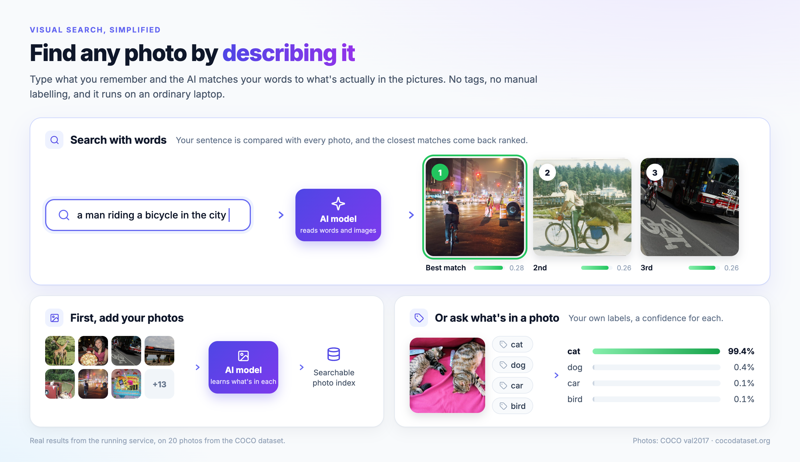
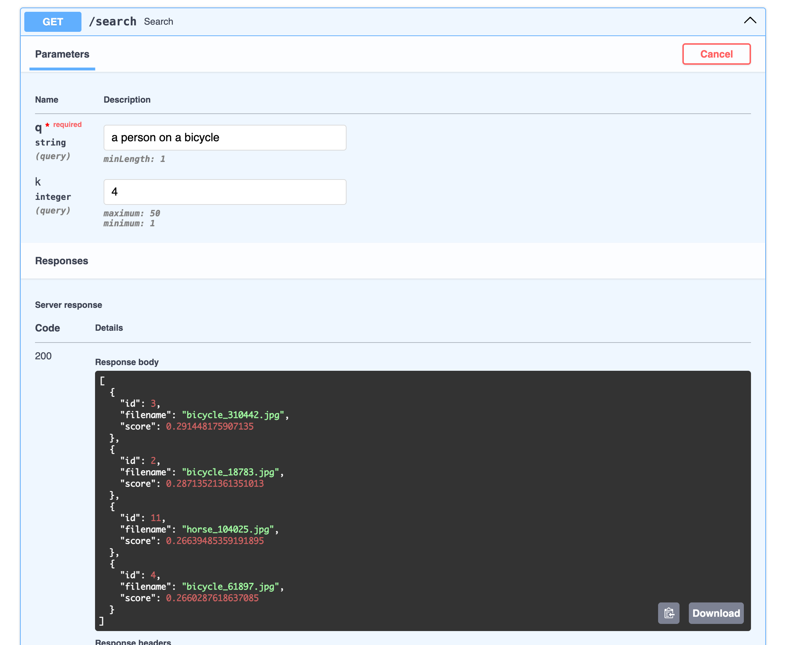
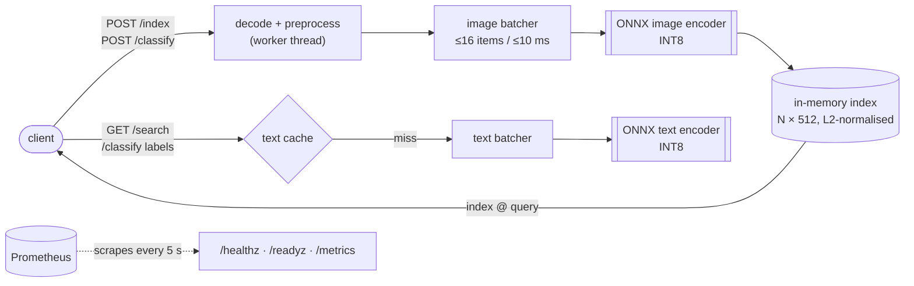
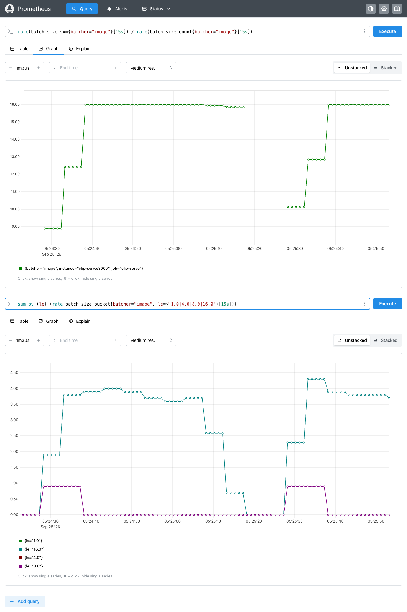

<div align="center">

# 🔎 Find Photos by Describing Them

**Type "a red car at night" and get the matching pictures. No tags, no training, and it runs on an
ordinary laptop.**

<sub><b>CLIP-Serve</b>: a fast, compressed CLIP image-search service</sub>

[](https://github.com/alichr/visual-search-server/actions/workflows/ci.yml)


[Quickstart](#-quickstart) · [Your own photos](#-use-it-with-your-own-photos) ·
[API](#-api-reference) · [How it works](#-how-it-works) · [Results](#-results) ·
[Troubleshooting](#-troubleshooting)



<sub>Real output from this service on 20 COCO photos: every result and percentage above came from the
running service.</sub>

</div>

---

## ✨ What it does

CLIP-Serve wraps OpenAI's [CLIP](https://github.com/openai/CLIP) model in a small web service. You
send it images, and then you can:

| | Endpoint | Example |
| --- | --- | --- |
| 📥 **Index** images | `POST /index` | upload your holiday photos |
| 🔍 **Search** them with any text | `GET /search` | *"a red car at night"* → the best-matching photos |
| 🏷️ **Classify** an image with any labels | `POST /classify` | `labels = cat, dog, car` → `{"cat": 0.99, ...}` |

No training and no GPU needed: the model is compressed to INT8 and runs on an ordinary CPU.

<details>
<summary><b>What makes it production-style</b> (for reviewers)</summary>

- **Async micro-batching:** concurrent requests share one model call.
- **INT8 quantisation:** a 3.2× smaller model and 2–2.7× faster on Linux, with the same accuracy.
- **Torch-free runtime:** the server needs only onnxruntime, NumPy, Pillow and tokenizers.
- **Observability:** Prometheus metrics (latency, errors, batch size, queue depth, index size,
  model info) and JSON logs with a request ID on every line.
- **Deployment:** Docker (multi-stage, non-root, health-checked), docker-compose with Prometheus,
  and a Kubernetes manifest tested on kind.
- **CI:** GitHub Actions for lint, tests and a Docker end-to-end check, plus a GitLab CI mirror.

</details>

---

## 🚀 Quickstart

### What you need

| Requirement | Notes |
| --- | --- |
| [Docker Desktop](https://www.docker.com/products/docker-desktop/) (or Docker Engine + Compose) | Give Docker **at least 4 GB of memory**: *Settings → Resources*. The first build needs over 2 GB. |
| About **6 GB free disk** | For the build (Python packages and the model download) |
| Internet on the first run | Downloads the CLIP weights (~600 MB) from Hugging Face |

Tested on macOS (Apple Silicon) and Linux (x86-64 and arm64, in CI and Docker). Windows should
work through WSL 2 but hasn't been tested.

### Step 1: get the code

```bash
git clone https://github.com/alichr/visual-search-server.git
cd visual-search-server
```

### Step 2: start the service

```bash
docker compose up --build
```

> [!NOTE]
> The **first** build takes about 5 minutes. It downloads CLIP and converts it to a compact ONNX
> model. Later starts take a few seconds. The service is ready when `docker compose ps` shows
> **`(healthy)`**.

### Step 3: try it

Open **http://localhost:8000/docs**. Every endpoint has a **Try it out** button there:

<p align="center"></p>

Or, from a second terminal, download two sample photos and try the three main calls:

```bash
curl -so cats.jpg    http://images.cocodataset.org/val2017/000000039769.jpg
curl -so bedroom.jpg http://images.cocodataset.org/val2017/000000000632.jpg

# 1. Index them
curl -F "files=@cats.jpg" -F "files=@bedroom.jpg" localhost:8000/index
# → {"ids":[0,1],"index_size":2}

# 2. Search with text
curl "localhost:8000/search?q=two%20cats%20on%20a%20sofa&k=2"
# → [{"id":0,"filename":"cats.jpg","score":0.288},{"id":1,"filename":"bedroom.jpg","score":0.196}]

# 3. Classify with your own labels
curl -F "file=@cats.jpg" -F "labels=cat, dog, car" localhost:8000/classify
# → {"cat":0.990,"dog":0.008,"car":0.002}
```

To stop everything, press **Ctrl+C** or run `docker compose down`.

---

## 📸 Use it with your own photos

**Index a whole folder.** This works in bash and zsh, including filenames with spaces:

```bash
for f in ~/Pictures/*.jpg; do curl -s -F "files=@$f" localhost:8000/index; echo; done
```

**Search it.** Describe what you're looking for in plain English. Put `%20` in place of each space,
or use the `/docs` page, which does it for you:

```bash
curl "localhost:8000/search?q=a%20sunset%20over%20the%20sea&k=5"
curl "localhost:8000/search?q=a%20birthday%20cake&k=5"
```

**Classify a photo** against labels you choose:

```bash
curl -F "file=@holiday.jpg" -F "labels=beach, mountain, city, forest" localhost:8000/classify
```

> [!TIP]
> - **Scores are relative.** CLIP similarity scores are small (typically 0.2–0.35, even for a good
>   match), so compare rankings, not raw numbers.
> - **Label choice matters.** For `/classify`, the answer is always one of your labels, so include
>   every label that could plausibly apply.
> - **Formats:** any format Pillow can read works, including JPEG, PNG, WebP, GIF, BMP and TIFF.
>   Phone photos are rotated upright automatically.
> - **The index lives in memory,** so it's empty again after a restart. Just re-index.

---

## 🐍 Run without Docker (local Python)

You'll need **Python 3.11**.

```bash
python3.11 -m venv .venv && source .venv/bin/activate      # Windows: .venv\Scripts\activate

# Linux only: install CPU-only torch first, to avoid the ~2 GB CUDA download
# pip install torch==2.14.0 --index-url https://download.pytorch.org/whl/cpu

pip install -r requirements-dev.txt
python export.py --out models/      # one-off: download CLIP, export FP32 + INT8 ONNX (~1 min)
uvicorn app.main:app --port 8000    # then open http://localhost:8000/docs
```

Check that everything works with `pytest -q`, which should show `3 passed`.

---

## 📖 API reference

Interactive documentation with typed schemas: **http://localhost:8000/docs**

| Endpoint | Send | Get back | Errors |
| --- | --- | --- | --- |
| `POST /index` | one or more image files, as the form field `files` | `{"ids": [...], "index_size": n}` | 415 if a file isn't a readable image |
| `GET /search?q=...&k=5` | text query `q`; `k` from 1 to 50 | top-k `[{"id", "filename", "score"}]` | 409 if the index is empty · 422 if `q` is empty |
| `POST /classify` | an image as the field `file`, plus a `labels` field (comma-separated) | `{label: probability}`, best first | 415 bad image · 422 no labels |
| `GET /healthz` | – | 200 while the process is alive (**liveness**) | – |
| `GET /readyz` | – | 200 once the models are loaded and warmed up (**readiness**) | 503 while starting |
| `GET /metrics` | – | Prometheus metrics (text) | – |

Uploads are checked by actually decoding them, not by trusting the file extension. Oversized
"decompression bomb" images are rejected.

---

## ⚙️ Configuration

Set these as environment variables, or under `environment:` in `docker-compose.yml`:

| Variable | Default | What it does |
| --- | --- | --- |
| `PRECISION` | `int8` | `int8` (small and fast) or `fp32` (exact). Any other value stops the server at start-up. |
| `MAX_BATCH` | `16` | Largest micro-batch. Set it to `1` to turn batching off. |
| `MAX_WAIT_MS` | `10` | Longest a request waits for others to join its batch |
| `ORT_THREADS` | `2` | CPU threads per model call. **Set it to your CPU limit.** |
| `MODEL_DIR` | `models` (`/models` in Docker) | Folder holding the `.onnx` models and `tokenizer.json` |

For a **smaller image**, build without the FP32 models (0.27 GB instead of 0.67 GB compressed):
`docker build --build-arg INT8_ONLY=1 -t clip-serve:int8 .`

---

## 🧠 How it works



1. **Images** are decoded and resized in a worker thread, so the server never stalls.
2. The **image batcher** groups requests that arrive within 10 ms, up to 16 of them, and runs them
   through the model in one pass. Each caller gets its own result back.
3. **Text** (search queries and labels) is checked against a **cache**. Only new text goes to the
   **text batcher**, which runs one model call at a time so the CPU isn't overloaded.
4. Every image and text becomes a **512-number vector** of length 1. Searching N images is then a
   single matrix multiply. Classifying is a softmax over the scores for `"a photo of a {label}"`.

<details>
<summary><b>🛠️ Design decisions</b> (why it's built this way)</summary>

- **Why ONNX Runtime.** It's a small, CPU-optimised runtime, so the image needs no torch or
  transformers. It lets you set thread counts explicitly, and can switch to CUDA, TensorRT or
  OpenVINO execution providers without code changes. Every export is checked against PyTorch:
  cosine 1.00000 for FP32.
- **Why dynamic INT8 quantisation.** It needs no calibration data. Weights are stored as 8-bit
  integers, which makes them 4× smaller, and activations are quantised on the fly. The details
  matter, and each one came from measuring:
  - **UInt8 weights, not Int8.** On x86 CPUs without AVX-512 VNNI, the Int8 kernel saturates. On a
    GitHub Actions runner, image-embedding cosine against FP32 dropped to **0.40**. UInt8 weights
    give about 0.99 on macOS arm64, Linux arm64 and x86 AVX2.
  - **The text encoder's MLP `fc2` layers stay FP32.** Their activations have outliers. Without
    this, text cosine is about 0.89 on Linux; with it, 0.999. The text model is 102 MB instead of
    64 MB.
  - **A parity gate.** `export.py` fails the build if FP32 cosine drops below 0.999 or INT8 below
    0.97, so a bad model can't ship silently.
  - **The trade-off.** An INT8 embedding depends slightly on which other images share its batch,
    because the activation scale is computed per batch. On real photos this is typically
    cosine ≥ 0.99. `PRECISION=fp32` is fully deterministic.
- **How batching trades latency for throughput.** Waiting up to `MAX_WAIT_MS` lets concurrent
  requests share one forward pass. Under load that raises throughput (+29% for INT8 at
  concurrency 32). At low load it only adds latency (about +30 ms, because a `/classify` goes
  through both batchers). A batcher runs one batch at a time, so ONNX Runtime always has all
  `ORT_THREADS` cores to itself.
- **Explicit thread counts.** ONNX Runtime uses every host core by default, and inside a
  container it can still see all of the host's cores. With 5 workers sharing 10 cores, the default
  gave a p95 of 105 ms, against 30 ms with `ORT_THREADS=2`.
- **Liveness vs readiness.** `/healthz` only says the process is up; if it fails, Kubernetes
  restarts the pod. `/readyz` turns 200 only after warm-up has actually run the models, and it
  stays 503 if warm-up fails. So traffic only reaches pods that can serve it.
- **One worker per container.** The batcher and the index live inside one process. Several
  uvicorn workers would split the batches, load the models several times over, and each hold a
  different index. You scale by adding replicas, each sized with `ORT_THREADS` equal to its CPU
  limit.
- **Matching preprocessing exactly.** Preprocessing mismatches are the most common cause of
  silent accuracy drops. The NumPy/Pillow version here matches the Hugging Face processor exactly
  on 9 test images, including grayscale, RGBA, tiny and odd-sized ones. It also follows EXIF
  rotation, which the Hugging Face processor doesn't.

</details>

---

## 📊 Results

Zero-shot accuracy on 500 [Imagenette](https://github.com/fastai/imagenette) images, and
`/classify` throughput at concurrency c. Each configuration ran in a Docker container limited to
4 CPUs, on an Apple M4 laptop.

| Config | Model size | Accuracy (top-1) | Latency at c=1 (p50) | Throughput at c=32 |
| --- | ---: | ---: | ---: | ---: |
| FP32, no batching | 606 MB | 98.4% | 31 ms | 34.0 req/s |
| FP32, batching | 606 MB | 98.4% | 61 ms | 38.2 req/s |
| INT8, no batching | 191 MB | 98.4% | **14 ms** | 78.8 req/s |
| **INT8, batching** (default) | **191 MB** | **98.4%** | 45 ms | **101.9 req/s** |

**In two sentences:** INT8 is the clear win, with a 3.2× smaller model and 2–2.7× the throughput at
the same accuracy. Micro-batching adds a further 29% under load, but costs about 30 ms per request at
low load, so on CPU it's worth enabling only when requests actually overlap.

<details>
<summary><b>Full benchmark table, method and analysis</b></summary>

**Setup.** Apple M4 (4 performance + 6 efficiency cores), Docker Desktop Linux aarch64 VM. Each
configuration ran in a fresh container with `--cpus=4` and `ORT_THREADS=4`.

- **Accuracy:** 50 images per class, with the prompt `"a photo of a {class}"`.
- **Load:** 256 `/classify` requests at each concurrency level (one photo, 10 labels), sent with
  `httpx.AsyncClient`.

Reproduce it with `python bench.py all`. The raw numbers are in
[`docs/bench_results.json`](docs/bench_results.json).

| Config | c=1 p50 / p95 (ms) | c=1 req/s | c=8 p50 / p95 (ms) | c=8 req/s | c=32 p50 / p95 (ms) | c=32 req/s | c=32 mean batch |
| --- | --- | --- | --- | --- | --- | --- | --- |
| FP32, no batching | 31 / 34 | 31.7 | 232 / 242 | 34.3 | 935 / 954 | 34.0 | 1.0 |
| FP32, batching | 61 / 66 | 16.3 | 210 / 219 | 37.8 | 808 / 952 | 38.2 | 15.1 |
| INT8, no batching | 14 / 17 | 66.8 | 99 / 115 | 78.5 | 401 / 421 | 78.8 | 1.0 |
| INT8, batching | 45 / 48 | 22.4 | 88 / 101 | 89.1 | 303 / 336 | 101.9 | 15.1 |

- **Platform matters.** On macOS the same INT8 files were barely faster than FP32. The Linux
  kernels are where INT8 pays off.
- **Why batching gains are modest on CPU.** A batch of 16 costs almost 16× a single image, so
  batching saves only per-call overhead. On a GPU the gain would be much larger.
- **Why batching adds ~30 ms at c=1.** A `/classify` goes through two batchers in turn (image,
  then text), and each waits up to `MAX_WAIT_MS=10` for other requests to join.
- **Sanity check.** At c=32 without batching, p50 ≈ concurrency ÷ throughput (32 / 78.8 ≈ 406 ms;
  measured 401 ms). That latency is queueing, not slow inference.
- **A bottleneck the benchmark found.** The first run gave only 5.1 req/s at c=32, and throughput
  *fell* as concurrency rose. Every `/classify` was re-embedding its 10 labels: 113 ms of
  text-encoder work against 22 ms for the image. Those calls also ran in parallel threads that
  oversubscribed the CPU. The text cache and the text batcher raised throughput **20×**. The
  benchmark reuses the same labels, so it measures the cached path; never-seen labels still pay
  the text cost.

During a c=32 run, Prometheus shows the mean batch size holding at the `MAX_BATCH=16` cap:



</details>

---

## ✅ Testing and CI

`pytest -q` runs 3 smoke tests in about 1 second. They use the real app and the INT8 models, and
generate their test images with Pillow, so no test files are committed.

1. `/readyz` returns 200 after start-up.
2. A solid-red image with the labels "red, blue" is classified as red. This catches colour-channel
   bugs: when BGR is swapped in on purpose, it fails.
3. After indexing a green and a yellow square, "a green square" returns both, green first.

[GitHub Actions](.github/workflows/ci.yml) runs on every push and pull request. It's the pipeline
that actually runs; [`.gitlab-ci.yml`](.gitlab-ci.yml) mirrors the same stages for GitLab CI and
isn't wired to a GitLab project.

| Stage | What it does |
| --- | --- |
| **lint** | `ruff check .` and `ruff format --check .` |
| **test** | Installs CPU-only torch, runs `export.py` (which fails on bad FP32/INT8 parity), then `pytest` against INT8. pip and Hugging Face downloads are cached. |
| **build** | Builds the Docker image, runs it, waits for `/readyz`, and sends one real `/classify` request. On `v*` tags it also publishes the image to GitHub Container Registry. |

---

## ☸️ Deployment

**Docker.** Multi-stage build: the first stage installs CPU-only torch and runs `export.py`. The
final image has **no torch or transformers**, runs as a non-root user, and has a health check on
`/readyz`.

- **Image size:** 0.67 GB compressed, or 0.27 GB with `INT8_ONLY=1`.
- **Memory at runtime:** about 310 MiB idle, about 450 MiB under load.
- **Published images:** tagged releases (`v*`) are published as
  `ghcr.io/alichr/visual-search-server:<tag>`.

<details>
<summary><b>Kubernetes</b> (tested on kind)</summary>

[`deploy/k8s.yaml`](deploy/k8s.yaml) defines a Deployment with 2 replicas and a ClusterIP Service.

```bash
kind create cluster --name clip
kind load docker-image clip-serve:latest --name clip
kubectl apply -f deploy/k8s.yaml
kubectl rollout status deployment/clip-serve
kubectl port-forward svc/clip-serve 8000:80   # then open http://localhost:8000/docs
```

- **Probes:** liveness on `/healthz`, readiness on `/readyz`.
- **Resources:** 1–2 CPUs with `ORT_THREADS=2`, and 512 Mi–1 Gi of memory.
- **Hardening:** non-root, a read-only root filesystem, all capabilities dropped, and a writable
  `/tmp` volume for uploads.
- **Rolling updates:** `maxUnavailable: 0` plus a 5 s `preStop` pause. Under load, 1 of ~1,750
  requests failed across two rolling restarts; without the pause, 5 of ~740 failed.
- **Metrics:** Prometheus scrape annotations on the pod template.

</details>

---

## 🩺 Troubleshooting

| Problem | Fix |
| --- | --- |
| The build stops during `export.py` (`exit code 137` / "Killed") | Docker ran out of memory. Give it at least 4 GB: *Docker Desktop → Settings → Resources*. |
| `port is already allocated` | Something else is using port 8000 or 9090. Stop it, or change the left-hand number in `docker-compose.yml`, for example `"8001:8000"`. |
| `curl: (7) Failed to connect` just after starting | The service is still warming up. Wait until `docker compose ps` shows `(healthy)`. |
| `409 Index is empty` | Index some images with `POST /index` first. The index is in memory, so it's empty after every restart. |
| `415 ... is not a readable image` | The file isn't an image Pillow can read. Check that the path after `@` is correct. |
| `zsh: no matches found` | The folder has no files matching the pattern. Try `*.jpeg` or `*.png`, or check the folder path. |
| **Windows** PowerShell: `curl` behaves oddly | Use `curl.exe` instead of `curl`, or run the commands in WSL or Git Bash. |
| Local run: `NoSuchFile ... models/image_int8.onnx` | Run `python export.py --out models/` first, from the repository root. |
| Local run: `ModuleNotFoundError: No module named 'app'` | Run the commands from the repository root folder. |

---

## 🗺️ Limitations and next steps

- **The index is in memory, per replica.** It's lost on restart, and each replica has its own. Next
  step: store the embeddings in a shared vector database (pgvector, Qdrant or Milvus), and add an
  `INDEX_DIR` option to index a folder at start-up.
- **CPU only.** Next step: GPU, via ONNX Runtime's CUDA or TensorRT execution provider, where
  batching pays off far more. Beyond that, a dedicated serving platform such as NVIDIA Triton or
  Ray Serve.
- **Autoscaling.** Next step: a HorizontalPodAutoscaler driven by the `queue_depth` metric, rather
  than by CPU.
- **Batching at low load.** Next step: dispatch straight away when nothing else is queued. That
  removes the ~30 ms cost at concurrency 1.
- **Quantisation.** Next step: static (calibrated) quantisation, so INT8 results no longer depend
  on which images share a batch.
- **Security.** Next step: authentication, rate limiting, upload size limits and TLS. None of
  these is implemented yet.

---

## 📁 Project layout

```
app/
  model.py         ONNX sessions, preprocessing, tokenisation, cached embeddings
  batcher.py       async micro-batching queue with batch-size / queue-depth metrics
  main.py          FastAPI routes, index, metrics and JSON-log middleware, health checks
tests/test_api.py  smoke tests
export.py          export CLIP to ONNX, quantise to INT8, check parity   (offline tooling)
bench.py           accuracy + load benchmark, every config in Docker     (offline tooling)
deploy/            prometheus.yml, k8s.yaml
docs/              screenshots and benchmark results
```

Model weights (`models/`), datasets (`data/`) and `*.onnx` files are never committed.

---

## 📏 Line count and credits

The service and its tests are **under 200 lines of Python**. Counted with
[cloc](https://github.com/AlDanial/cloc) (`cloc --include-lang=Python app tests`):

```
-------------------------------------------------------------------------------
Language                     files          blank        comment           code
-------------------------------------------------------------------------------
Python                           4             69             16            199
-------------------------------------------------------------------------------
```

The offline tooling, `export.py` and `bench.py`, adds 263 lines, for 462 in total.

- **Model:** CLIP ViT-B/32 by OpenAI, released under the MIT licence
  ([openai/CLIP](https://github.com/openai/CLIP)) and loaded from Hugging Face as
  `openai/clip-vit-base-patch32`. Radford et al., *Learning Transferable Visual Models From Natural
  Language Supervision*, ICML 2021.
  <details>
  <summary>BibTeX</summary>

  ```bibtex
  @inproceedings{radford2021clip,
    title     = {Learning Transferable Visual Models From Natural Language Supervision},
    author    = {Radford, Alec and Kim, Jong Wook and Hallacy, Chris and Ramesh, Aditya and Goh, Gabriel and
                 Agarwal, Sandhini and Sastry, Girish and Askell, Amanda and Mishkin, Pamela and Clark, Jack and
                 Krueger, Gretchen and Sutskever, Ilya},
    booktitle = {International Conference on Machine Learning (ICML)},
    year      = {2021}
  }
  ```

  </details>
- **Evaluation data:** [Imagenette](https://github.com/fastai/imagenette) by fast.ai, a 10-class
  subset of ImageNet. It's downloaded for benchmarking and not redistributed.
- **Demo photos:** from [COCO](https://cocodataset.org/) val2017 (Flickr images under their
  respective Creative Commons licences). Small thumbnails appear in `docs/hero.png`. The full photos
  are fetched at run time and not committed.
- **Licence:** this repository is released under the [Apache License 2.0](LICENSE).
